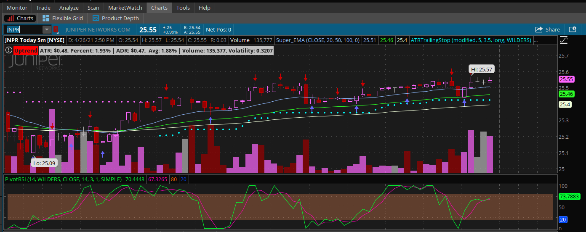
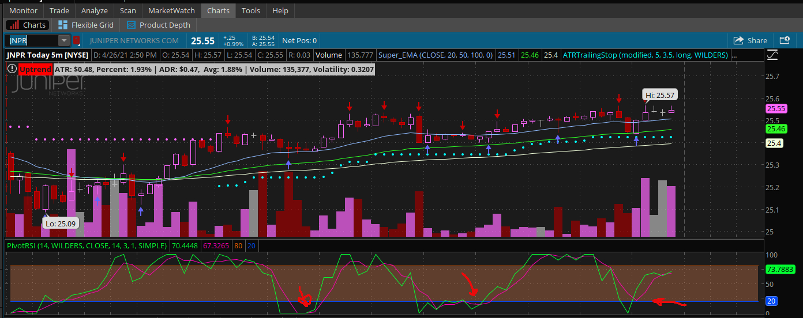
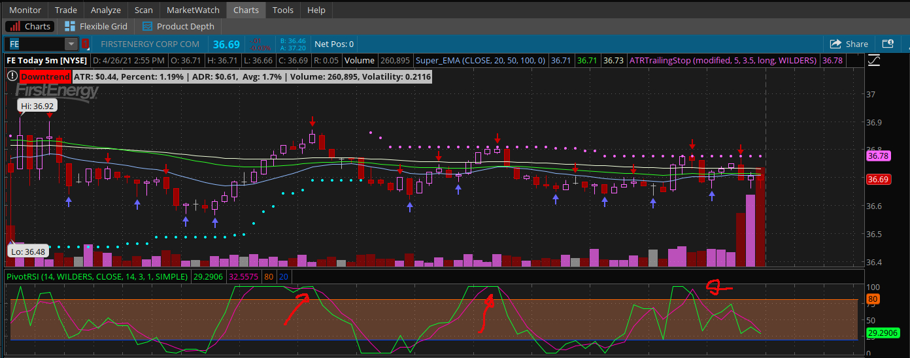

# Pivot RSI  

**Discloser** _In order to demonstrate the functionality of my script, I used actual symbol in the chart image. However, I do not make recommendations or determine the suitability of any security or strategy for individual traders. Any investment decision you make in your self-directed account is solely your responsibility._  

This is like the StochRSI script, But I had changed somethings in order for it to work with a strategy I call "Pivot On EMA", _use this link to learn more about this strategy: [PivotOnEMA](https://www.github.com/TechRancher/PivotOnEMA/)_, which will help indicate when to buy or sell.

You can download this script with this link: [Pivot_RSI](https://tos.mx/vyB3CWp)  

## How To Use  

After installing the script. You can navigate to Charts tab. And choose Pivot_RSI in the chart studies.  As you can see from the image below:  
  
This is what it will look like.  Two color lines that wiggle up and down with a colored section in the middle from 25 to 80.  The way how this works is the wiggly color lines represent the movement of price up or down. From 25 to 0 represents that the stock could be oversold based off the time that you can set in the customization options.  From 80 to 100 represents that the stock could be overbought based off the same time frame as oversold. Default for Oversold and Overbought are set at 14 under rsi length.  25 and 80 can not be changed without changing the script.  

This can be used two ways: Give a Buy Long Signal or Sell Short Signal.  
I will walk you through how to recognize when to buy long and when to sell short.  

### How To Use For Buy Long  

When both the colored wiggle lines go below the 25 and then start going back up, this would be your buy long signal.  Image below shows arrows to indicate buy signals.    
As you can see the arrows are pointing to the point right when the colored wiggle lines start moving up.  This would be your buy long signal.  

### How To Use For Sell Short  

When both the colored wiggle lines go above the 80 and then start going back down, this would be your sell short signal.  Image below shows arrows to indicate sell short signal.    
As you can see the arrows are pointing to the point right when the colored wiggle lines start moving down.  This would be your sell short signal.  

#### Conclusion  

Using just this Pivot RSI alone will help you with finding entries but I would suggest you do your back testing on this before using it live with your hard earned money.  I use this with my [Pivot On EMA Strategy](https://www.github.com/TechRancher/PivotOnEMA/) to achieve higher win results.  

If you are new to all this. Check out how to get ThinkorSwim:registered: from TD Ameritrade:tm: at: [https://www.tdameritrade.com/tools-and-platforms.page/](https://www.tdameritrade.com/tools-and-platforms.page/)  
